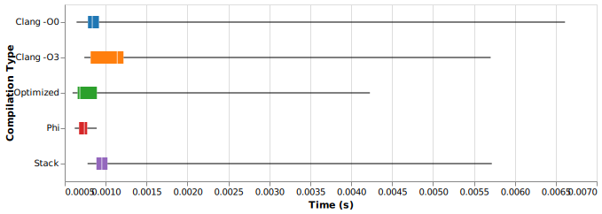
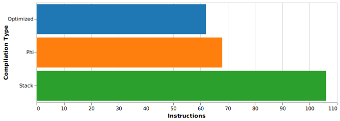
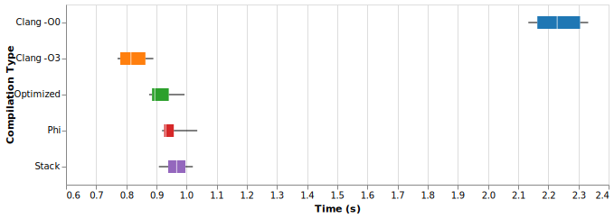
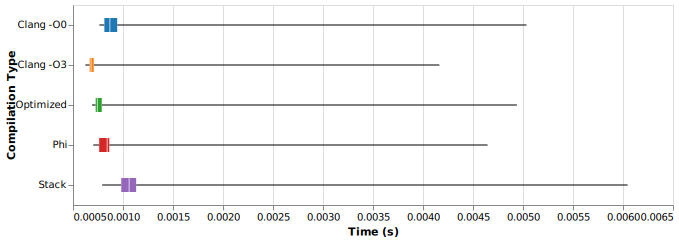

# Overview 

## Parsing

For our compiler, we decided not to use ANTLR or any other parser generator. Instead, we wrote our own tokenizer and parser.

{width=300px}

{width=300px}

{width=300px}

{width=300px}

{width=300px}

## Static Semantics:

### Type Checking

### Return path checking

## Intermediate Representation

Our compiler stores the IR as a list of functions.
Each function then stores a list of all the registers,
instructions, and basic blocks. Each basic block stores and ordered list of references to instructions. Each instruction stores references to the registers it uses as well as the register it writes to and any other instruction specific data.

The IR is used as a control flow graph as well through the references which the basic blocks hold. This is especially useful for


## Optimizations:
For our compiler, we implemented the following optimizations:

### Sparse Conditional Constant Propagation
First, we implemented SCCP which propogates constant values. If while propogating a constant value, a conditional branch is reached, and the condition is known, we only continue propogating down that branch. Once we are finished any unreachable basic blocks are removed, and references to things in the blocks like phi nodes are replaced with the constant value.

### Comparison Propagation
On top of SCCP, we implemented comparison propagation. This is an extention of SCCP that evalueates comparisons and removes redundant ones. For example, if we check that a value is less than some number and then check again if it is biger than some larger number, we can remove the child comparison as it is impossible to be true. We also can create constants from direct comparisons. For example, if we compare a value to 0, we can do constant propogation on the value in the branch where it is the case where the value is 0.

### Dead Code Elimination
Finaly, we implemented mark and sweep dead code elimination. This was fairly straightforward to implement. For each function in the IR, we first marked all the side effects like calls as well as the return value. Then we marked everything that the marked values relied on. Finally we removed anything not marked.

### Empty Block Removal
Somewhat related to dead code elimination, we also implemented empty block removal which removes any basic blocks with only a single jump instruction.

# Analysis

## BenchMarkishTopics


```{.include}
./media/BenchMarkishTopics-stats.md
```


## Fibonacci


```{.include}
./media/Fibonacci-stats.md
```


## GeneralFunctAndOptimize


```{.include}
./media/GeneralFunctAndOptimize-stats.md
```


## OptimizationBenchmark


```{.include}
./media/OptimizationBenchmark-stats.md
```


## TicTac


```{.include}
./media/TicTac-stats.md
```


## array_sort



```{.include}
./media/array_sort-stats.md
```


## array_sum


```{.include}
./media/array_sum-stats.md
```


## bert


```{.include}
./media/bert-stats.md
```


## biggest


```{.include}
./media/biggest-stats.md
```



## binaryConverter


```{.include}
./media/binaryConverter-stats.md
```


## brett


```{.include}
./media/brett-stats.md
```


## creativeBenchMarkName


```{.include}
./media/creativeBenchMarkName-stats.md
```


## fact_sum


```{.include}
./media/fact_sum-stats.md
```


## hailstone


```{.include}
./media/hailstone-stats.md
```


## hanoi_benchmark


```{.include}
./media/hanoi_benchmark-stats.md
```


## killerBubbles



```{.include}
./media/killerBubbles-stats.md
```


## mile1


```{.include}
./media/mile1-stats.md
```


## mixed


```{.include}
./media/mixed-stats.md
```


## primes


```{.include}
./media/primes-stats.md
```


## programBreaker


```{.include}
./media/programBreaker-stats.md
```


## stats



```{.include}
./media/stats-stats.md
```


## wasteOfCycles


```{.include}
./media/wasteOfCycles-stats.md
```


